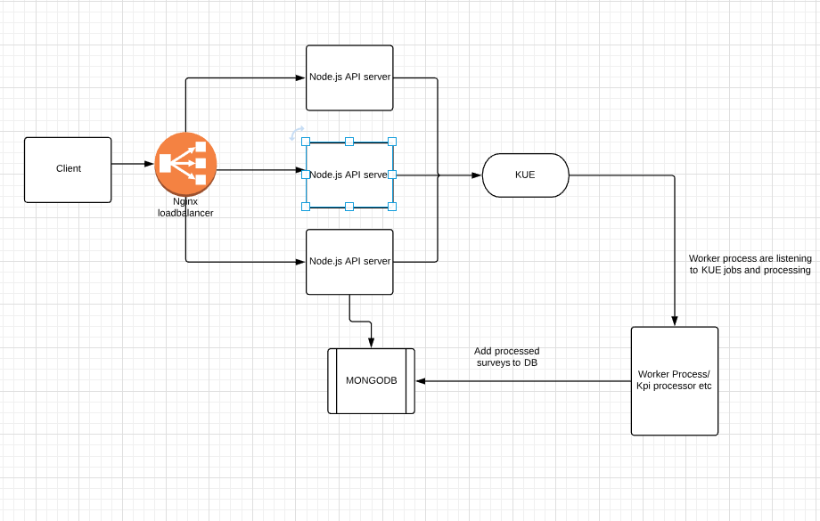

# SaaS Product Server
Retail SaaS Application Server

## Major components And Architecture Overview

- API server - [Express.js](https://expressjs.com) Server to handle API request from Admin panel and Auditor mobile app.
- Database - Using [MongoDB](https://www.mongodb.com/) database, [ORM mongoose](https://mongoosejs.com/) is using as node.js Driver.
- Processors and Workers - Script to process surveys, compute KPIs from Questions POCs and workers to send email etc.
- Queue - [KUE](https://github.com/Automattic/kue) is redis backed Queue.



## How to start development

- Install all dependencies and major components like node.js>=10.x.x and npm([nvm](https://github.com/creationix/nvm),[N](https://www.npmjs.com/package/n),[other](https://github.com/creationix/nvm)), [mongodb](https://docs.mongodb.com/manual/tutorial/install-mongodb-on-ubuntu/), [redis](https://www.digitalocean.com/community/tutorials/how-to-install-and-secure-redis-on-ubuntu-18-04).
- Project using [typescript](https://www.typescriptlang.org/) as language. All the build and styling configuration can be found in root of the repository. (tslint.json, tsconfig.json, gulpfile.js and tsfmt.json)
- Project configuration is managed by [dotEnv](https://github.com/motdotla/dotenv). Sample of .env file can be found from [sample.env](https://gitlab.com/productization/backend/blob/master/sample.env). Create .env file in root and modify for development environment.
- Using [pino](https://github.com/pinojs/pino) as logger, You may need to install [Pino-pretty](https://github.com/pinojs/pino-pretty) to make logs more readable.)

```bash
npm install
npm run twatch # or npm run dev. This will transpile .ts files from ./src and put it into ./dist folder
node dist/Server.js # nodemon dist/Server.js or node dist/Server.js or node dist/Server.js | pino-pretty -t
```

### How to deploy app

- Project using [gitlab CI/CD](https://docs.gitlab.com/ee/ci/) for staging/dev server deployments.
- For all [git-tag](https://git-scm.com/book/en/v2/Git-Basics-Tagging) CI/CD will test and deploy the app in staging server.

Check [.gitlab-ci.yml](https://gitlab.com/productization/backend/blob/master/.gitlab-ci.yml) for more information.

- In Production servers we are doing manual deployment

```bash
# Merge all changes to release branch and Pull the release branch in production.
npm ci
npm run tbuild # or npm run build. This will transpile .ts files from ./src and put it into ./dist folder
NODE_ENV=production npm start
```

## How Authentication

- The application or client requests authorization to the server with email and password.
- When the authorization is granted, the authorization server returns an access token to the application.
- We are using JSON Web Token [JWT](https://jwt.io/introduction/) is an open standard (RFC 7519) that defines a compact and self-contained way for securely transmitting information between parties as a JSON object.
- The application uses this access token to access a protected resource (like an API).
